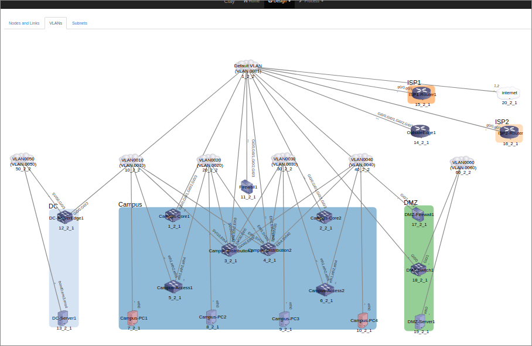
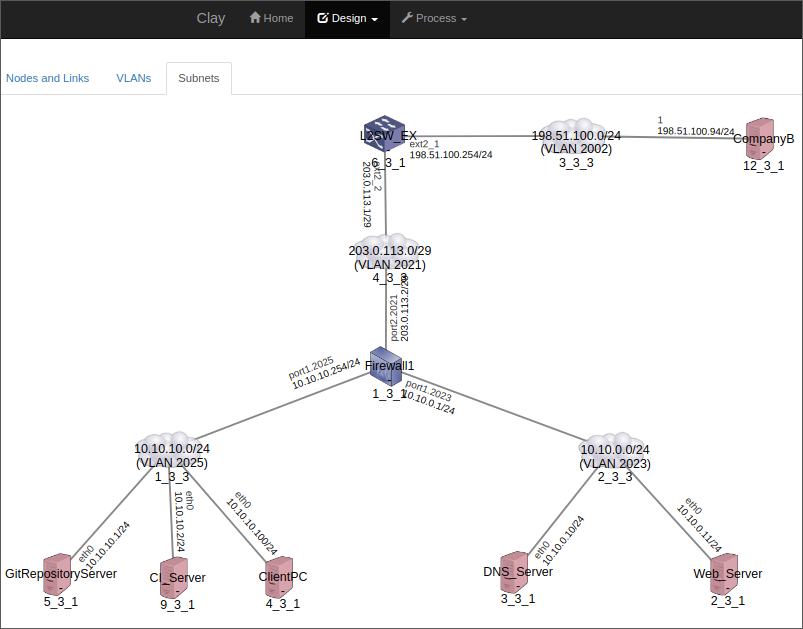

# Summary

Clay is an abstract system model store to automate something.
It provides some APIs to access the system model store, and sample UI.

### Sample UI - network design


### Sample UI - physial diagram from the system model stora


### Sample UI - logical diagram from the system model stora


# How to use

```
$ go build
$ AUTOMIGRATE=1 ./clay
```
server runs at http://localhost:8080

# Example model

```
$ curl -X PUT localhost:8080/v1/designs/present -H "Content-Type: application/json" -d @examples/design.json
```

# API Server

Simple Rest API using gin(framework) & gorm(orm)

## Endpoint list

### Nodes Resource

```
GET    /<version>/nodes
GET    /<version>/nodes/:id
POST   /<version>/nodes
PUT    /<version>/nodes/:id
DELETE /<version>/nodes/:id
```

### NodeGroups Resource

```
GET    /<version>/nodegroups
GET    /<version>/nodegroups/:id
POST   /<version>/nodegroups
PUT    /<version>/nodegroups/:id
DELETE /<version>/nodegroups/:id
```

### NodePvs Resource

```
GET    /<version>/nodepvs
GET    /<version>/nodepvs/:id
POST   /<version>/nodepvs
PUT    /<version>/nodepvs/:id
DELETE /<version>/nodepvs/:id
```

### NodeTypes Resource

```
GET    /<version>/nodetypes
GET    /<version>/nodetypes/:id
POST   /<version>/nodetypes
PUT    /<version>/nodetypes/:id
DELETE /<version>/nodetypes/:id
```

### Ports Resource

```
GET    /<version>/ports
GET    /<version>/ports/:id
POST   /<version>/ports
PUT    /<version>/ports/:id
DELETE /<version>/ports/:id
```

# UI

Access http://localhost:8080/ui/

# Thanks

* Clay was partially generated by https://github.com/wantedly/apig
* Clay uses https://github.com/codeout/inet-henge
